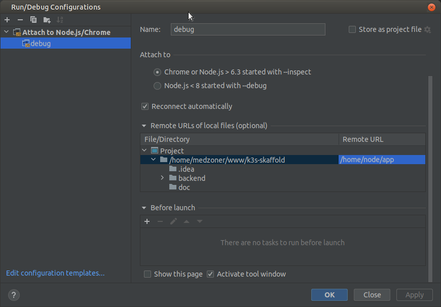

# K3s Skaffold
[](LICENSE)

## Short Description
Poc for local development continue
Tested only on Ubuntu 21.04

## Init
```shell
$ init.sh
```

## Build to dev
```shell
$ skaffold dev
```

## Debug in jetbrains



## Developed & Maintained by
[Mehdi Youb](https://github.com/Medzoner)

## License
[](LICENSE)
